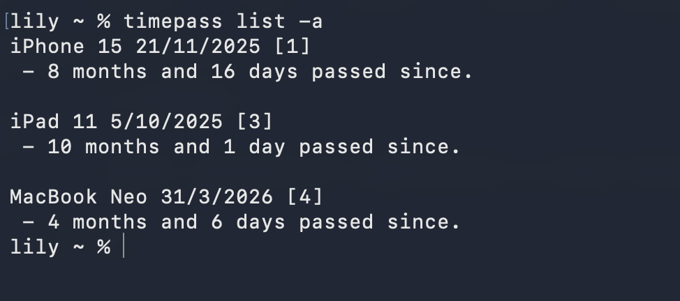

# TimePass

Small, personal CLI application to track time.



# Running

This application is made with LuaJIT, so you can either run it as is, or figure out how to compile it.

```bash
git clone https://github.com/hexedrevii/TimePass

cd TimePass/
```

To run the app, you will need LuaJIT, it does not run with regular lua.

You can run it with:

```bash
luajit main.lua --help
```

# Installation

To actually compile it, you will need a C compiler, LuaJIT libraries, and amalg.lua

Amalg.lua is a simple script that amalgamates multiple lua files into a single file. We use this to create a single, byte-code baked file for C to read.

Instructions are found in the [repository](https://github.com/siffiejoe/lua-amalg).

Now, we can start building.

```bash
amalg -s main.lua -o timepass.lua lib.argparse lib.json modules.fs modules.time
```

We now create the byte-code.

```bash
luajit -b -n timepass_script timepass.lua timepass.h
```

Now, based on your system, you will need to get the libraries needed.

# Unix

```bash
# Linux
# With ubuntu/debian/fedora
sudo apt install luajit gcc
sudo dnf in luajit gcc

# MacOS
# With brew
brew install luajit
```

Now, you can finally compile the app.

```bash
# With brew
gcc -O2 core.c -o timepass -L/opt/homebrew/lib -lluajit-5.1 -I/opt/homebrew/include/luajit-2.1

# Without brew
gcc -O2 core.c -o timepass -lluajit-5.1 -I/usr/include/luajit-2.1
```

# Windows

If you're on windows, your best bet will be to install clang, and find luajit precompiled libraries.

LuaJIT path will vary depending on where you install it, windows has no standard library directory.

```bash
clang -O2 core.c -o timepass.exe -I C:\luajit\include -L C:\luajit\lib -llua51
```

> [!CAUTION]
> Unlike Unix, Windows won't automatically find shared libraries. You must copy lua51.dll from your LuaJIT folder into the exact same folder as timepass.exe before running it, or the app will crash on startup.
